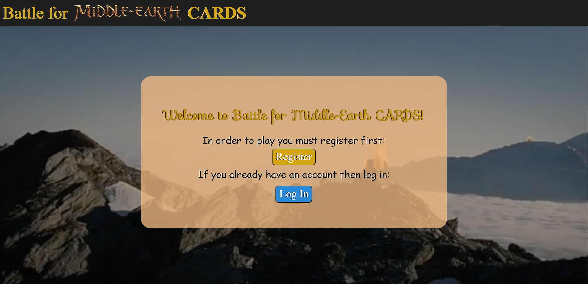
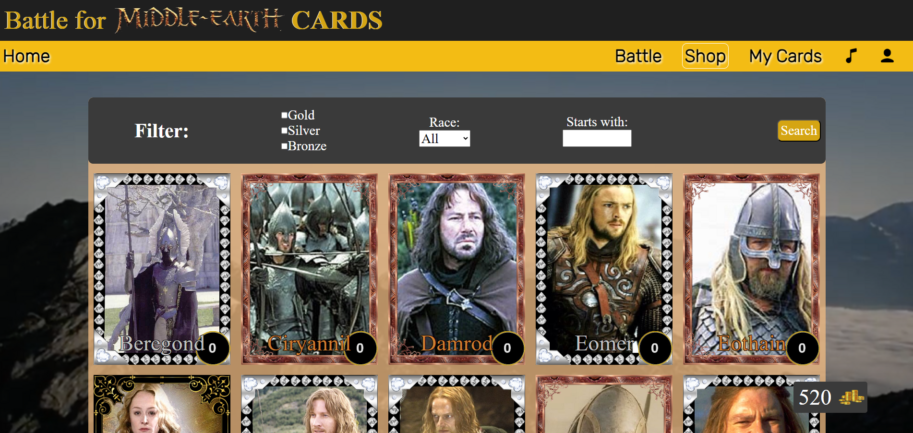
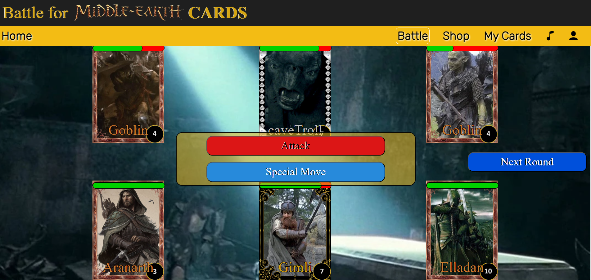

<h1>Welcome to Battle for Middle-Earth CARDS, the ultimate card Game of The Lord of the Rings</h1>
In order to play and explore Middle-Earth you must register first:

Once you have an acount you will be able to navigate between menus:
In Home you will find your statistics. 
In Shop you will be able to buy your favourite cards, explore their special abilities and filter them to find the ones you want faster.
In my Cards you can look at your cards, explore their stadistics to choose the right one for a battle and upgrade them for coins.

Now you are ready to play. Dont worry we'll give you 3 new cards to fight your first Battle. Each card has an unique attack and special move. Collect all cards to be able to fight even the strongest enemies! Follow the Fellowship through Moria and into the battlefield!

Win battles to obtain rewards, level up your cards and unlock different battles. Play with your friends and compete to see which one of you finishes the game first!
Hope you enjoy the game <a href="">here</a>!